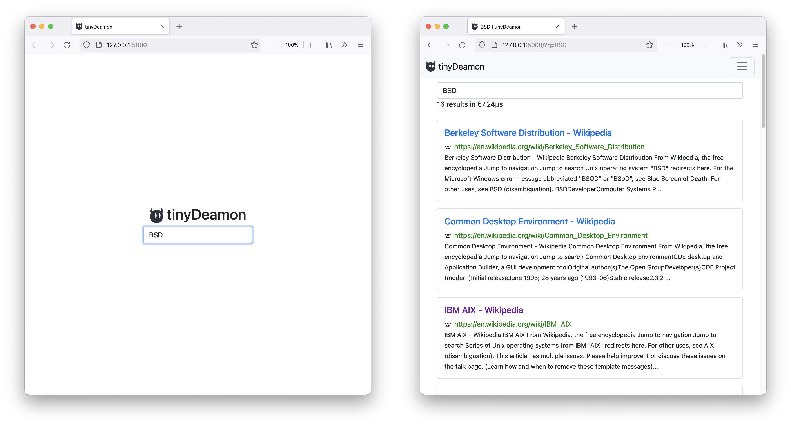

# tinydeamon


An experimental search engine

**Try it out:** https://tinydeamon.com

## About

tinyDeamon is a experimental search engine (like google) that uses its own
index and does not rely on google/bing etc. The main purpose is for me to learn
how search engines work and not to replace any of the big players.

## Limitations

- Basic result ranking ([BM25](https://en.wikipedia.org/wiki/Okapi_BM25))
- Crawler is inpolite
- Index must fit on a single's computer harddrive (well you could use a network drive to work around this issue)
- Crawler cannot be distributed
- Crawler is single-threaded
- No filters (while I am against censorship, there is content on the internet that is so disturbing that my searchengine shouldn't display it per default)

## Roadmap

[ ] Rewrite Storage to use mongoDB (and containerize application)
[ ] Make crawler polite (parsing robots.txt etc.)
[ ] Distribute crawler
[ ] Improve Ranking (maybe pagerank 🤷‍♀️)

## Run it locally

### Requirements

1. You will need a recent version of [python](https://www.python.org/downloads/) (preferable 3.9)
2. I would recommend using [python's virtual environments](https://docs.python.org/3/library/venv.html)

**Unix:**

```
python3 -m venv venv
source venv/bin/activate
```

**Windows:**

```
py -3 -m venv venv
venv\Scripts\activate
```

3. Lastly, you will need to install the dependencies with
   `pip install -r requirements.txt`

### Crawler

The crawler takes two arguments, first the number of websites it should crawl,
and a list of websites with which it should start (this is often called the seed).

For example to index 20 pages, starting with GitHub and BBC we can run:

```
python3 crawler.py --limit 20 https://github.com https://www.bbc.com/
```

### Server

```
FLASK_APP=server FLASK_ENV=development flask run
```

**Note:** this will spawn only a development server which is not suited for
production. Read [this page](https://flask.palletsprojects.com/en/2.0.x/tutorial/deploy/)
in flasks documentation on how to deploy a flask app.

## Deployment

**Note:** This is how I deployed the service, it is far from perfect and I really want to improve the setup. In no way should this be a recommendation, it is just a mental note for myself.

1. Rent a Ubuntu 20.04 server.
2. Create an unprivilged user called `flo` with `adduser`
3. Install python 3.9 (like in this [article](https://linuxize.com/post/how-to-install-python-3-9-on-ubuntu-20-04/))

4. Install python dev and venv with:

```
sudo apt install python3.9-venv
sudo apt install python3.9-dev
```

5. Install nginx (first two steps from this [article](https://www.digitalocean.com/community/tutorials/how-to-install-nginx-on-ubuntu-18-04))
6. Clone the repo with `git clone https://github.com/flofriday/tinydeamon.git`
7. Create venv and activate with

```
python3.9 -m venv venv
source venv/bin/activate
```

8. Install the dependencies with:

```
pip install -r requirements.txt
pip install uwsgi
```

9. Intall the service file with:

```
sudo cp /home/flo/tinydeamon/tinydeamon.service /etc/systemd/system/
```

12. Run the crawler. For example with:

```
python3 crawler.py --limit 20 https://github.com https://www.bbc.com/
```

11. Start the service with:

```
sudo systemctl start tinydeamon
sudo systemctl enable tinydeamon
```

12. Configure nginx (described in step 6 of this [article](https://www.digitalocean.com/community/tutorials/how-to-serve-flask-applications-with-uswgi-and-nginx-on-ubuntu-18-04))
